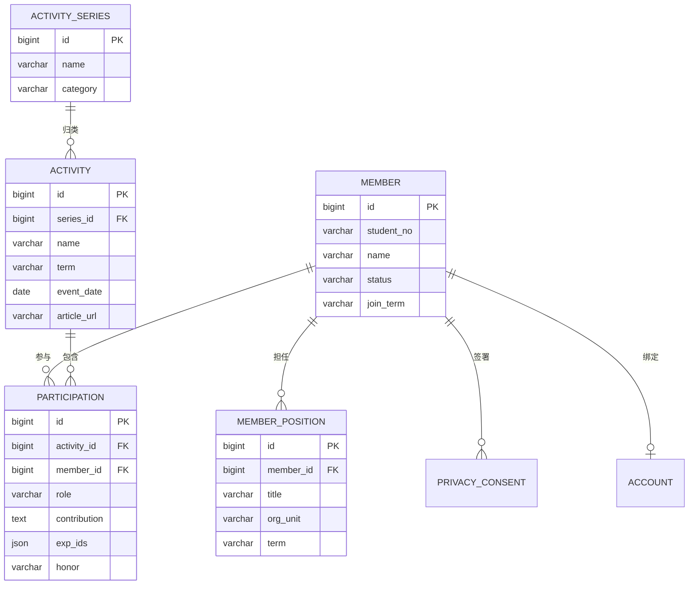

# 学术科创部知识库 · 需求文档 v1.0

> 需求方：学术科创部（学创部）
> 交付对象：学创部技术组
> 编写日期：2026-09-10
> 交付范围：**需求文档 + 数据库 schema 设计**（实现由技术组负责）

---

## 1. 背景与目标

### 1.1 背景

学创部活动多、届数长（2021 年至今近 20 项官方活动、多个品牌系列），但部门资产散落：成员名单靠临时表格、活动记录靠推文和记忆、换届交接靠口口相传。需要一个统一的知识库沉淀下来。

### 1.2 目标

建立部门级知识系统，第一优先级是两块：

1. **成员信息录入** —— 成员档案，内外分层，支撑通讯、换届、评优、对外宣传
2. **活动参与记录** —— 谁在哪个活动里做了什么分工、关联了哪些经验

长期目标：把部门所有可复用资产（成员、活动、参与、经验、推文）统一成可查询、可交接的知识库。

### 1.3 本期不做什么

- 不做完整管理后台/前端（技术组自行决定是否做）
- 不追求历年部员完整回溯（数据难找，只在有数据时补录）
- 不重做经验库的语义检索（沿用现有向量库方案）
- 本期只录**当前学年（2026-2027）本部门成员**，历史成员与外部人员不导入

---

## 2. 交付范围

| 交付物 | 说明 |
|--------|------|
| 本需求文档 | 功能、数据、非功能需求 |
| 交接文档 | 数据源现状、初始化步骤、部署、待办（见 `docs/交接文档.md`） |
| 数据库 schema 设计 | MySQL 建表 DDL + 字段说明 + ER 关系（见 `schema/schema.sql`） |
| 活动初始化数据 | 19 项官方活动系列（见 `data/activities-seed.sql`） |

技术组负责：建库、初始化数据、按需实现录入/查询工具、部署到服务器。

---

## 3. 术语

| 术语 | 含义 |
|------|------|
| 成员 member | 部门成员（本部门部员，及经授权入库的老师/嘉宾） |
| 活动系列 series | 一个品牌/栏目，如"惟学沙龙""师说新语" |
| 活动场次 activity | 系列下的具体一次，如"惟学沙龙第 3 期" |
| 参与记录 participation | 某成员在某场活动中的分工与贡献 |
| 经验 experience | 经验知识库（向量库）里的条目，如带队经验 |
| 届别 term | 学年维度，如 2026-2027 |

---

## 4. 系统定位与架构

### 4.1 两套并存，id 关联

| 子系统 | 存什么 | 技术 | 负责 |
|--------|--------|------|------|
| 结构化库 | 成员、活动、参与记录、职务 | **MySQL** | 技术组 |
| 经验库 | 非结构化经验文本 | 向量库（Chroma，现有项目） | 沿用 |

两者**通过 id 关联**，不合成一个库。原因：MySQL 管不了语义检索，向量库管不了关联查询，各司其职。

### 4.2 部署要求

- MySQL 部署在团队服务器（内网，不暴露公网）
- 字符集 `utf8mb4`，排序规则 `utf8mb4_unicode_ci`
- 版本 MySQL 8.0+（需要 JSON 字段与全文索引）
- 详细部署现状见 `docs/交接文档.md`

### 4.3 账号体系

- **复用学校统一身份认证（CAS）**，不自建密码
- 用户首次进入时用 CAS 登录，系统按学号/工号绑定到成员记录

---

## 5. 角色与权限（分级）

| 角色 | 成员信息 | 敏感字段 | 活动/参与 | 账号管理 |
|------|---------|---------|-----------|---------|
| 管理员（部长/技术组） | 全部读写 | 可见 | 全部读写 | 可管理 |
| 管理层（副部长/组长） | 读写 | 部分可见 | 读写 | 无 |
| 普通部员 | 看对外版，改本人信息 | 不可见 | 录本人参与记录 | 无 |
| 外部（老师/嘉宾） | 看本人对外版 | 不可见 | 录本人参与 | 无 |

**敏感字段**：学号、手机、QQ、微信、邮箱、班级。仅管理员（及必要的管理层）可见，接口层做字段脱敏。

### 5.1 隐私声明机制（重要）

非本部门成员（老师、嘉宾、外院志愿者）在入库或注册账号**之前**，必须先阅读并同意隐私声明：

- 声明需说明：收集哪些信息、用途、可见范围、撤回方式
- 成员**自主选择**是否入库/注册，不强制
- 同意状态记入 `privacy_consent` 表（含声明版本号、同意时间）
- 撤回同意后可删除或匿名化其记录

---

## 6. 数据模型

### 6.1 ER 关系

### 6.2 成员字段全清单

> 分层：`内` = 仅内部可见，`外` = 对外简版可见。

**A 基础身份**

| 字段 | 类型 | 说明 | 层级 | 敏感 |
|------|------|------|------|------|
| id | bigint PK | 主键 | 系统 | 否 |
| name | varchar(50) | 姓名 | 内外 | 否 |
| student_no | varchar(30) | 学号/工号（唯一） | 内 | 是 |
| gender | tinyint | 性别 | 内外 | 否 |
| grade | varchar(10) | 年级（2026级） | 内外 | 否 |
| major | varchar(100) | 专业 | 内外 | 否 |
| class_no | varchar(50) | 班级 | 内 | 是 |
| birthday | date | 生日 | 内 | 是 |

**B 组织任职**

| 字段 | 类型 | 说明 | 层级 |
|------|------|------|------|
| join_term | varchar(20) | 入部学年（2026-2027） | 内外 |
| status | varchar(20) | 在部/退部/毕业/请假 | 内 |
| org_unit | varchar(50) | 所属组（分组待定，见待确认项） | 内外 |
| title | varchar(50) | 职务（部长/副部长/组长/部员） | 内外 |
| member_type | varchar(20) | 成员类型（本部门/外部） | 内 |

**C 联系方式（全部敏感，仅内部）**

| 字段 | 类型 | 说明 |
|------|------|------|
| phone | varchar(20) | 手机 |
| qq | varchar(20) | QQ |
| wechat | varchar(50) | 微信 |
| email | varchar(100) | 邮箱 |

**D 能力与档案**

| 字段 | 类型 | 说明 | 层级 |
|------|------|------|------|
| skills | json | 技能标签（编程/AI/设计/摄影/写作/主持） | 内外 |
| bio_short | varchar(200) | 简短介绍（一句话） | 内外 |
| bio_long | text | 详细介绍 | 内 |
| avatar | varchar(255) | 头像 URL | 内外 |
| honors | json | 获奖/荣誉 | 内外 |
| contribution | text | 对部门贡献（期末评优用） | 内 |
| remark | text | 备注 | 内 |

**E 系统字段**

| 字段 | 类型 | 说明 |
|------|------|------|
| created_at | datetime | 创建时间 |
| updated_at | datetime | 更新时间 |
| deleted_at | datetime | 软删除 |

**自动聚合（不用手填）**：活动履历由 `participation` 关联查询得出。
**对外简版卡片 =** name + title/org_unit + bio_short + avatar + skills + 参与亮点。

### 6.3 活动表（系列 + 场次两层）

**activity_series（系列）**

| 字段 | 类型 | 说明 |
|------|------|------|
| id | bigint PK | 主键 |
| name | varchar(100) | 系列名（惟学沙龙） |
| category | varchar(50) | 类别（学业支持/科研启蒙/讲座课堂/师生交流/导师制度/竞赛赛事/组织建设） |
| description | text | 系列定位 |
| is_official | tinyint | 是否官方活动 |

**activity（场次）**

| 字段 | 类型 | 说明 |
|------|------|------|
| id | bigint PK | 主键 |
| series_id | bigint FK | 所属系列（可空：一次性活动） |
| name | varchar(200) | 场次名（惟学沙龙第 3 期） |
| term | varchar(20) | 学年/学期 |
| event_date | date | 活动日期 |
| location | varchar(200) | 地点 |
| status | varchar(20) | 计划/进行中/已完成/取消 |
| article_url | varchar(500) | 关联推文链接 |
| description | text | 活动说明 |
| created_at / updated_at | datetime | |

### 6.4 参与记录（重点）

> 活动单独建表，参与记录**以活动为外键**，记录成员的分工与相关经验。

| 字段 | 类型 | 说明 |
|------|------|------|
| id | bigint PK | 主键 |
| activity_id | bigint FK | → activity.id |
| member_id | bigint FK | → member.id |
| role | varchar(50) | 分工/角色（负责人/主讲/执行/志愿者/观众） |
| contribution | text | 贡献说明（做了什么） |
| hours | decimal(5,1) | 投入工时（小时），**选填**——记录成本高，建议只做粗粒度记录或省略 |
| honor | varchar(100) | 评优/获奖（如有） |
| exp_ids | json | 关联经验 id 列表（向量库的 exp-xxx） |
| created_at / updated_at | datetime | |

约束：`(activity_id, member_id, role)` 唯一，允许一人多角色。

### 6.5 职务表（多职务 / 换届）

| 字段 | 类型 | 说明 |
|------|------|------|
| id | bigint PK | |
| member_id | bigint FK | → member.id |
| title | varchar(50) | 部长/副部长/组长/组员 |
| org_unit | varchar(50) | 所属组 |
| term | varchar(20) | 任期学年 |
| is_current | tinyint | 是否现任 |

### 6.6 隐私授权表

| 字段 | 类型 | 说明 |
|------|------|------|
| id | bigint PK | |
| member_id | bigint FK | |
| consented | tinyint | 是否同意入库/注册 |
| scope | varchar(50) | 授权范围（入库/公开卡片） |
| policy_version | varchar(20) | 声明版本 |
| consented_at | datetime | 同意时间 |
| revoked_at | datetime | 撤回时间 |

### 6.7 账号表（CAS 绑定）

| 字段 | 类型 | 说明 |
|------|------|------|
| id | bigint PK | |
| member_id | bigint FK | → member.id |
| cas_uid | varchar(50) | 统一身份 uid（按学号/工号） |
| role | varchar(20) | 管理员/管理层/部员/外部 |
| last_login_at | datetime | |

---

## 7. 功能需求

### FR-1 成员管理
- 新增/编辑/查询成员，字段按 §6.2 分层
- 按届别、状态、组织、技能筛选
- 对外简版卡片导出

### FR-2 活动管理
- 系列活动 + 场次两级录入
- 场次关联推文链接、日期、地点、状态
- 初始化 19 项官方活动系列（见 `data/`）

### FR-3 参与记录
- 选活动 → 加参与成员 → 填分工/贡献/评优
- 关联经验（双向，见 §9）
- 一人多角色

### FR-4 职务与换届
- 记录每届职务分配，标记现任
- 换届时批量更新 `is_current`

### FR-5 统计与导出
- 成员维度：某人参与过哪些活动、任过什么职
- 活动维度：某场/某系列参与人数、分工分布
- 导出：通讯录、活动台账、换届花名册

### FR-6 隐私与授权
- 隐私声明展示 + 同意记录
- 非本部门成员自主决定是否入库/注册
- 撤回同意后删除/匿名化

### FR-7 账号与权限
- CAS 登录，绑定成员
- 按角色做字段级脱敏

---

## 8. 非功能需求

| 项 | 要求 |
|----|------|
| 部署 | 团队服务器，内网，不暴露公网 |
| 字符集 | utf8mb4 / utf8mb4_unicode_ci |
| 版本 | MySQL 8.0+ |
| 安全 | 敏感字段字段级脱敏；数据库账号分级；只内网访问 |
| 备份 | 定期 dump |
| 合规 | 隐私声明 + 授权记录，可撤回 |
| 兼容 | 与经验库（向量库）用 id 关联，不互相依赖部署 |

---

## 9. 与经验库的关联设计（双向）

经验库 Metadata 现有字段：`author_id`、`activity_id`。

- **正向**：`participation.exp_ids` 存经验 id 列表 → 从参与记录查经验
- **反向**：经验 metadata 增补 `participation_id` 字段 → 从经验查参与记录

约定：
- MySQL 的 `member.id` / `activity.id` 与经验库的 `author_id` / `activity_id` 用同一套 id（建议 MySQL 主键直接作为共享 id）
- 经验 id 格式沿用 `exp-{timestamp}`，MySQL 以字符串存

---

## 10. 验收标准

- [ ] MySQL 建库完成，用 `schema/schema.sql` 一键建表，无报错
- [ ] 能录入当届成员，按届别/组织/状态查询
- [ ] 能录入一个系列活动 + 场次，并关联成员参与记录（含分工）
- [ ] 参与记录能关联至少一条经验，且能从经验反查到参与记录
- [ ] 非本部门成员入库前需同意隐私声明，状态可查
- [ ] 敏感字段对普通部员脱敏
- [ ] 19 项官方活动系列成功初始化
- [ ] 部署在团队服务器且仅内网可访问

---

## 11. 需求确认记录

已确认决策（2026-09-10）：

| # | 决策 |
|---|------|
| 1 | 交付范围：需求文档 + schema 设计，不含实现 |
| 2 | 成员信息：内外分层 |
| 3 | 参与记录：活动单独建表，参与记录外键引用活动，记分工与相关经验 |
| 4 | 经验库：两套并存，id 关联，双向 |
| 5 | 届别：全员带 |
| 6 | 活动：系列 + 场次两层 |
| 7 | 权限：分级 |
| 8 | 部署：团队服务器（内网） |
| 9 | 非部门成员：隐私声明 + 自主选择 |
| 10 | 成员数据：只录当前学年本部门成员，历史/外部不导入 |
| 11 | 账号：学校统一身份 CAS |
| 12 | 工时：可保留字段，但不强制（记录成本高） |

---

## 附：待确认项

| # | 事项 | 状态 |
|---|------|------|
| 1 | 部门内部分组（org_unit 枚举） | 待需求方确认 |
| 2 | 成员分层字段的最终内/外划分 | 待需求方确认 |
| 3 | 隐私声明文本 | 待起草 |
| 4 | CAS 对接方式（服务器在内网，CAS 回调可能需内网穿透或代理） | 待技术组评估 |
| 5 | 历史推文是否入库并关联活动 | 待确认 |
| 6 | 敏感数据（学号/手机/邮箱）入库的授权方式 | 待确认 |
